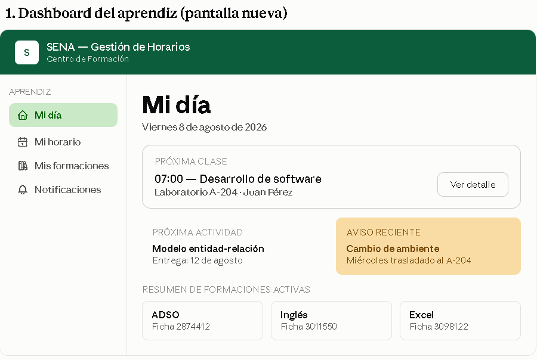
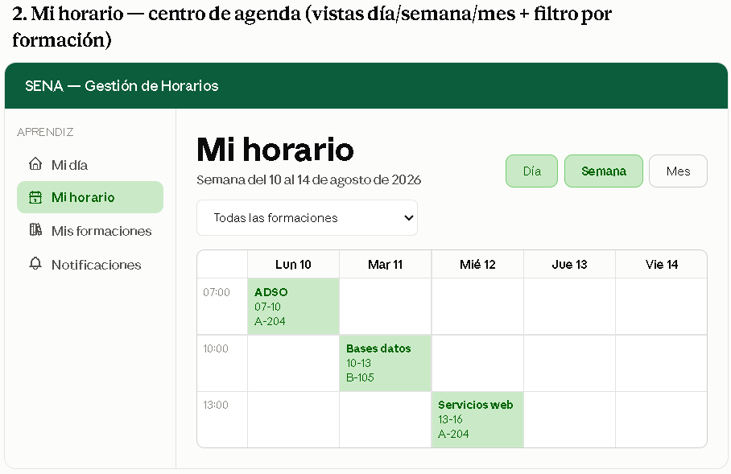
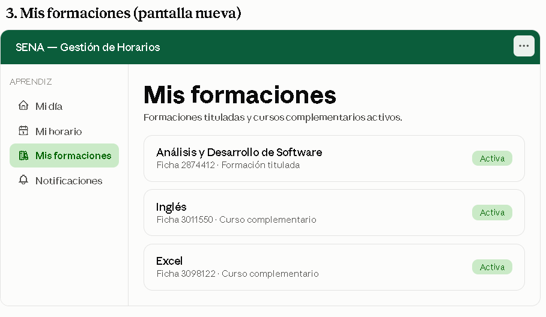
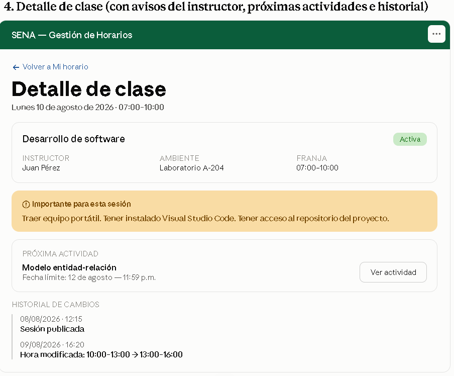
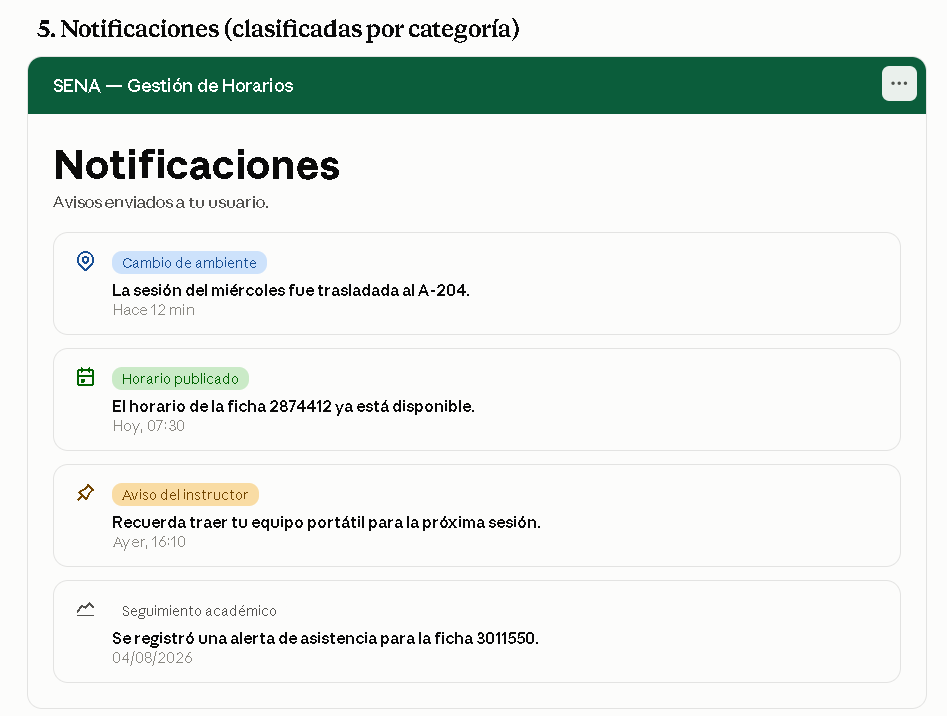
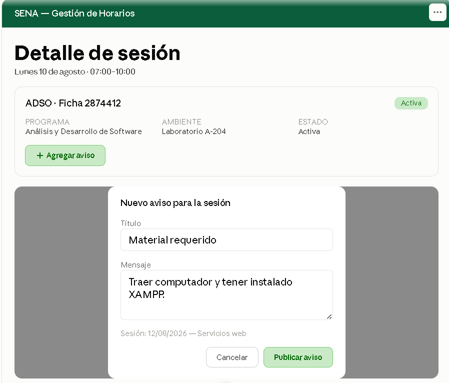

# Informe de recomendaciones — SENA Gestión de Horarios

> Mockup de referencia: [code-sena.github.io/design-software-mockup](https://code-sena.github.io/design-software-mockup/)
> Prototipo estático de pantallas y modales organizadas por rol (RBAC), sin persistencia de backend.

## Objetivo del informe

Este documento consolida las recomendaciones funcionales para el mockup **SENA — Gestión de Horarios**. El objetivo principal es fortalecer el sistema como una plataforma institucional para:

- Gestionar horarios y sesiones de formación.
- Permitir que aprendices consulten de forma clara toda su agenda en el SENA.
- Permitir que instructores administren sus sesiones, disponibilidad y avisos.
- Permitir que coordinadores organicen horarios, ambientes, fichas e instructores.
- Mantener **trazabilidad completa de las acciones relevantes**, de manera que exista una fuente de verdad ante cambios, conflictos, reclamos o inconvenientes.

> **Principio central:** toda modificación importante debe poder responder posteriormente a las preguntas **qué ocurrió, quién lo hizo, cuándo ocurrió, qué cambió, por qué se cambió y a quién afectó**.

---

## Índice

- [Parte I. Organización general del sistema](#parte-i-organización-general-del-sistema)
- [Parte II. Módulo Aprendiz](#parte-ii-módulo-aprendiz)
- [Parte III. Módulo Coordinador](#parte-iii-módulo-coordinador)
- [Parte IV. Módulo Instructor](#parte-iv-módulo-instructor)
- [Parte V. Módulo Administrador / Director](#parte-v-módulo-administrador--director)
- [Parte VI. Back-office y auditoría](#parte-vi-back-office-y-auditoría)
- [Parte VII. Parametrización](#parte-vii-parametrización)
- [Parte VIII. Capacidades transversales](#parte-viii-capacidades-transversales)
- [Parte IX. Priorización de recomendaciones](#parte-ix-priorización-de-recomendaciones)
- [Parte X. Principios de diseño y resultado esperado](#parte-x-principios-de-diseño-y-resultado-esperado)
- [Parte XI. Resultado final por pantalla](#parte-xi-resultado-final-por-pantalla)

---

# Parte I. Organización general del sistema

## 1. Estructura actual por roles

El mockup actual está organizado en 7 bloques, correspondientes a los roles del sistema:

| # | Bloque | Rol(es) principal(es) |
|---|---|---|
| 01 | Auth y shell | public / coordinator |
| 02 | Coordinador | coordinator |
| 03 | Instructor | instructor |
| 04 | Aprendiz | learner |
| 05 | Administrador / Director | director |
| 06 | Back-office | support |
| 07 | Parametrización | director |

Se recomienda **conservar esta estructura**, ya que separa correctamente las responsabilidades por rol y respeta el guard RBAC (acceso manual no permitido → 403).

## 2. Trazabilidad como capacidad transversal

La trazabilidad no debería ser únicamente una pantalla del Back-office. Debe existir como una **capacidad transversal** del sistema, presente en todos los módulos.

```text
Coordinador modifica horario
        ↓
Sistema registra la acción
        ↓
Se actualiza el horario
        ↓
Se genera notificación
        ↓
Instructor y aprendices reciben el cambio
        ↓
El sistema conserva el historial
```

De esta manera, el sistema puede reconstruir posteriormente lo sucedido. Esta idea se desarrolla en detalle dentro de cada módulo y se centraliza en la [Parte VI](#parte-vi-back-office-y-auditoría).

---

# Parte II. Módulo Aprendiz

Es el módulo que se recomienda **profundizar más**. Actualmente contiene:

- Mi horario — semana
- Notificaciones
- Detalle de clase
- Detalle de notificación

Se recomienda ampliar estas funcionalidades sin convertir el sistema en una plataforma LMS. El propósito continúa siendo **gestionar, consultar y comunicar la agenda de formación del aprendiz**.

## 1. Dashboard del aprendiz

Agregar una pantalla inicial que funcione como resumen, con:

- Próxima clase.
- Próximas clases del día.
- Próximas actividades.
- Avisos recientes.
- Cambios recientes de horario.
- Resumen de las formaciones activas.
- Acceso rápido al calendario.
- Notificaciones pendientes.

```text
MI DÍA

Próxima clase
07:00 — Desarrollo de software
Laboratorio A-204
Juan Pérez

Próximas actividades
Entrega: Modelo entidad-relación
Fecha límite: 12 de agosto

Avisos recientes
⚠ Cambio de ambiente
La sesión del miércoles fue trasladada al A-204.
```

## 2. Mi horario — centro de agenda académica

La pantalla actual de horario semanal debería evolucionar hacia un **centro de agenda académica**.

### 2.1 Vistas

Agregar vista de **Día**, **Semana** (principal) y **Mes / calendario** (visión general).

### 2.2 Representación gráfica

Representar las clases como bloques dentro de una cuadrícula horaria:

```text
             LUN       MAR       MIÉ       JUE       VIE

07:00      ┌──────┐
           │ ADSO │
10:00      └──────┘

10:00                ┌──────┐
                     │ Bases│
13:00                └──────┘

13:00                          ┌──────┐
                              │ Web  │
16:00                         └──────┘
```

Al seleccionar un bloque se abriría el **Detalle de clase**.

## 3. Múltiples fichas, cursos y formaciones

El sistema no debería asumir que un aprendiz solamente pertenece a una ficha. Se recomienda crear una sección **Mis formaciones**:

```text
Mis formaciones

ADSO
Ficha 2874412
Formación titulada

Inglés
Ficha 3011550
Curso complementario

Excel
Ficha 3098122
Curso complementario
```

El aprendiz debería poder:

- Ver todas sus formaciones.
- Consultar una formación individual.
- Filtrar el calendario por formación.
- Mostrar todas las clases juntas.
- Identificar fácilmente a qué ficha pertenece cada sesión.

Filtro recomendado:

```text
[ Todas las formaciones ▼ ]

☑ ADSO — 2874412
☐ Inglés — 3011550
☐ Excel — 3098122
```

Esto permite representar el **horario completo del aprendiz dentro del SENA**, incluyendo cursos complementarios y otras formaciones.

## 4. Detalle de clase

La pantalla actual ya contiene información importante: competencia, instructor, ambiente, ubicación, fecha, franja y notas de la sesión. Se recomienda ampliarla.

### 4.1 Información de la clase

Mantener: nombre de la competencia, ficha, programa, instructor, ambiente, ubicación, fecha, hora de inicio/fin y estado de la sesión.

### 4.2 Avisos e indicaciones del instructor

Agregar una sección **Avisos de la sesión**, distinta de una notificación general:

> **Importante para esta sesión**
>
> Traer equipo portátil.
>
> Tener instalado Visual Studio Code.
>
> Tener acceso al repositorio del proyecto.

> **Actividad especial**
>
> La sesión tendrá una actividad práctica que requiere computador.

Esto permite que el instructor deje instrucciones directamente asociadas a una clase.

## 5. Próximas actividades

Dentro del detalle de clase o del Dashboard:

```text
Próximas actividades

Entrega
Modelo entidad-relación

Fecha límite
12 de agosto — 11:59 PM

Competencia
Modelar bases de datos

[Ver actividad]
```

No es necesario convertirlo en un sistema académico completo; el objetivo es mostrar información relevante asociada a las sesiones.

## 6. Cambios de horario

Agregar una sección **Cambios recientes**:

```text
Cambio de ambiente
Miércoles 12 de agosto

Laboratorio A-204 → Laboratorio B-105

Modificado por:
Coordinación académica

Fecha del cambio:
08/08/2026 14:32
```

El aprendiz debe poder identificar qué cambió, cuándo, qué sesión fue afectada, quién realizó el cambio (cuando corresponda mostrarlo) y el estado actual.

## 7. Notificaciones

Mantener la pantalla existente, pero clasificar las notificaciones en categorías: cambio de horario, cambio de ambiente, cancelación, nueva sesión, aviso del instructor, publicación de horario, seguimiento académico, actividad o recordatorio.

```text
🔔 Cambio de ambiente
La sesión del miércoles fue trasladada al A-204.

📅 Actualización de horario
La franja de Modelar bases de datos fue modificada.

📌 Aviso del instructor
Recuerda traer tu equipo portátil para la próxima sesión.
```

## 8. Trazabilidad dentro del módulo Aprendiz

Aunque el aprendiz no necesita acceder a toda la auditoría institucional, sí debería poder consultar el **historial relevante de cambios que afecten su horario**:

```text
Historial de cambios

10/08/2026 — 08:30
Ambiente cambiado
A-204 → B-105

09/08/2026 — 16:20
Hora modificada
10:00–13:00 → 13:00–16:00

08/08/2026 — 12:15
Sesión publicada
```

Esto permite resolver situaciones como *"¿Por qué ayer aparecía otro ambiente?"* con una respuesta verificable.

## 9. Propuesta final de estructura

```text
APRENDIZ
│
├── Dashboard
│   ├── Próxima clase
│   ├── Próximas actividades
│   ├── Avisos
│   └── Cambios recientes
│
├── Mi horario
│   ├── Día
│   ├── Semana
│   ├── Mes
│   └── Filtros por formación
│
├── Mis formaciones
│   ├── ADSO
│   ├── Cursos complementarios
│   └── Otras formaciones
│
├── Detalle de clase
│   ├── Información
│   ├── Instructor
│   ├── Ambiente
│   ├── Avisos del instructor
│   ├── Próximas actividades
│   └── Historial de cambios relevantes
│
├── Notificaciones
│   └── Detalle de notificación
│
└── Perfil
```

---

# Parte III. Módulo Coordinador

El módulo de coordinador ya está bastante completo: Dashboard/Inicio, Horarios, Detalle de horario, Crear/editar horario, Agregar/editar sesión, Confirmar publicación, Panel de conflictos, Resolver conflicto, Disponibilidad, Detalle de ambiente, Fichas, Detalle de ficha.

## 1. Historial de cambios del horario

```text
08/08/2026 14:32
Coordinador: Carlos Gómez

Cambio de ambiente
A-204 → B-105

Motivo:
Mantenimiento del laboratorio A-204.
```

Otros posibles cambios a registrar: instructor, fecha, hora, ambiente, cancelación, reprogramación, creación/eliminación de sesión, publicación del horario.

## 2. Confirmar publicación

Al publicar se debe registrar quién publicó, fecha y hora, y generar la notificación correspondiente.

```text
Confirmar publicación de horario

[Cancelar] [Publicar horario]
```

## 3. Conflictos

El panel de conflictos debería permitir conocer qué elementos entran en conflicto, cuándo fue detectado, quién lo resolvió, qué decisión se tomó y cuándo se resolvió.

```text
Conflicto #023

Instructor:
Juan Pérez

Sesiones:
07:00–10:00
08:00–11:00

Estado:
Resuelto

Resolución:
Se modificó la segunda sesión.

Resuelto por:
Coordinador

Fecha:
08/08/2026 10:42
```

---

# Parte IV. Módulo Instructor

Actualmente incluye: Mi horario, Detalle de sesión, Mi disponibilidad, Crear excepción, Seguimiento de ficha, Registrar seguimiento. Se recomienda mantener estas pantallas y agregar comunicación y trazabilidad.

## 1. Avisos para una sesión

Desde **Detalle de sesión**, botón `[Agregar aviso]`:

```text
Título:
Material requerido

Mensaje:
Traer computador y tener instalado XAMPP.

Sesión:
12/08/2026 — Servicios web
```

El aviso aparecería en el detalle de clase del aprendiz.

## 2. Trazabilidad de acciones del instructor

Toda acción relevante debería quedar registrada, por ejemplo:

```text
Instructor creó aviso.
Instructor modificó disponibilidad.
Instructor registró excepción.
Instructor actualizó seguimiento.
Instructor solicitó cambio de sesión.
```

Si el instructor mueve o solicita mover una clase, el sistema debería conservar:

```text
Acción:
Solicitud de cambio de sesión

Sesión original:
10/08 — 07:00–10:00 — A-204

Cambio solicitado:
10/08 — 10:00–13:00 — B-105

Motivo:
Disponibilidad del instructor.

Estado:
Pendiente / Aprobado / Rechazado

Fecha:
08/08/2026 14:32
```

Esto evita que un cambio quede sin explicación.

---

# Parte V. Módulo Administrador / Director

Actualmente incluye: Panel de indicadores, Drill-down de KPI, Usuarios, Crear/editar usuario, Detalle de usuario, Asignar/revocar rol, Datos de referencia, Editar catálogo/valor/parámetro.

## 1. Indicadores

El dashboard puede mostrar:

- Fichas activas.
- Sesiones programadas.
- Conflictos sin resolver.

## 2. Indicadores de trazabilidad

```text
Cambios de horario hoy: 14
Cambios pendientes de aprobación: 3
Conflictos sin resolver: 2
Acciones administrativas: 28
Alertas generadas: 17
```

## 3. Gestión de usuarios y roles

Toda modificación de permisos debe generar trazabilidad:

```text
Usuario:
Juan Pérez

Acción:
Rol revocado

Rol anterior:
Instructor

Rol nuevo:
Aprendiz

Realizado por:
Administrador

Fecha:
08/08/2026 15:10
```

Esto es especialmente importante para RBAC.

---

# Parte VI. Back-office y auditoría

Actualmente contiene: Documentos, Plantillas, Auditoría, Parametrización/catálogos, Detalle de documento + versiones, Generación de documentos, Editor/preview, Detalle de auditoría, CRUD de catálogo. Esta sección debería convertirse en uno de los **principales puntos de trazabilidad** del sistema.

## 1. Auditoría central

La pantalla **Auditoría** debería permitir consultar todas las acciones relevantes, con filtros por: usuario, rol, fecha, módulo, tipo de acción, registro afectado y resultado.

```text
[Usuario ▼]
[Rol ▼]
[Módulo ▼]
[Acción ▼]
[Fecha ▼]

08/08/2026 14:32
Carlos Gómez
Coordinador

MODIFICÓ SESIÓN

Ficha: 2874412
Sesión: Desarrollo de software
Cambio: A-204 → B-105

Motivo:
Mantenimiento

Resultado:
Exitoso
```

## 2. Fuente de verdad institucional

La auditoría debe considerarse una **fuente de verdad institucional**. Para cada acción importante se recomienda guardar como mínimo:

| Dato | Descripción |
|---|---|
| ID del evento | Identificador único |
| Fecha y hora | Momento exacto |
| Usuario | Persona que realizó la acción |
| Rol | Rol utilizado |
| Acción | Crear, modificar, eliminar, publicar, etc. |
| Módulo | Área donde ocurrió |
| Registro afectado | ID de sesión, horario, ficha, usuario, etc. |
| Estado anterior | Información antes del cambio |
| Estado nuevo | Información después del cambio |
| Motivo | Razón del cambio cuando aplique |
| Resultado | Exitoso, rechazado, fallido, etc. |
| Origen | Web, sistema, proceso automático, etc. |

## 3. Ejemplo de trazabilidad completa (extremo a extremo)

```text
1. Instructor solicita cambio
   ↓
2. Sistema registra solicitud
   ↓
3. Coordinador revisa conflicto
   ↓
4. Coordinador aprueba cambio
   ↓
5. Sistema modifica la sesión
   ↓
6. Se registra el estado anterior y nuevo
   ↓
7. Se notifica al instructor
   ↓
8. Se notifica a los aprendices afectados
   ↓
9. El nuevo horario queda publicado
```

Posteriormente se podría consultar:

```text
Sesión #8291

Creada:
07/08/2026 09:20
Por: Coordinador

Modificada:
08/08/2026 14:32
Por: Coordinador

Cambio:
A-204 → B-105

Motivo:
Mantenimiento

Notificaciones:
✓ Instructor
✓ 32 aprendices

Publicación:
08/08/2026 14:35
```

Esto permite reconstruir completamente el evento.

## 4. Trazabilidad de documentos

Cada documento conserva la fecha de su última modificación y quién la realizó:

```text
Documento: Horario ficha 2874412

Última modificación:
08/08/2026 — Coordinación académica
```

---

# Parte VII. Parametrización

Actualmente incluye: Hub de parametrización, Currículo académico, Jornadas/franjas horarias, Tipos de ambiente e inventario, Catálogos de monitoreo, Estados de actores, Geografía institucional, RBAC.

## 1. Jornadas y franjas

```text
Jornada diurna
07:00–10:00
10:00–13:00
13:00–16:00

Jornada nocturna
18:00–21:00
```

Toda modificación debe conservar historial.

## 2. Ambientes e inventario

```text
Laboratorio A-204

Tipo:
Laboratorio

Capacidad:
30 aprendices

Equipamiento:
30 computadores

Ubicación:
Bloque A — Piso 2

Estado:
Disponible
```

También registrar cambios:

```text
08/08
Capacidad modificada
30 → 25

Motivo:
Mantenimiento
```

## 3. Trazabilidad de parametrización

Los valores institucionales también pueden afectar los horarios, por lo que deben registrarse cambios como:

```text
Cambio de franja horaria
07:00–10:00 → 07:30–10:30

Modificado por:
Administrador

Fecha:
08/08/2026

Motivo:
Actualización de jornada
```

Esto evita que una modificación de configuración quede sin explicación.

---

# Parte VIII. Capacidades transversales

## 1. Notificaciones

Cada notificación generada por un cambio queda con un estado claro:

```text
Notificación: Enviada / No enviada
```

La auditoría registra cuándo se generó y a quién iba dirigida.

## 2. Estados claros

Los elementos importantes deberían manejar estados consistentes:

| Elemento | Estados |
|---|---|
| Horario | Borrador · En revisión · Publicado · Modificado · Cancelado · Archivado |
| Solicitud de cambio | Pendiente · Aprobada · Rechazada · Cancelada |
| Notificación | Enviada · No enviada |
| Sesión | Programada · En curso · Finalizada · Modificada · Cancelada |

Los cambios de estado deben generar eventos de trazabilidad.

## 3. Arquitectura funcional recomendada

La aplicación puede entenderse como cuatro grandes capas:

```text
┌─────────────────────────────────────┐
│             USUARIOS                │
│ Aprendiz · Instructor · Coordinador │
│ Administrador · Soporte             │
└──────────────────┬──────────────────┘
                   ↓
┌─────────────────────────────────────┐
│              OPERACIÓN              │
│ Horarios · Sesiones · Fichas        │
│ Ambientes · Disponibilidad · Config │
└──────────────────┬──────────────────┘
                   ↓
┌─────────────────────────────────────┐
│          COMUNICACIÓN                │
│ Notificaciones · Avisos · Cambios   │
└──────────────────┬──────────────────┘
                   ↓
┌─────────────────────────────────────┐
│           TRAZABILIDAD              │
│ Auditoría · Historial                │
└─────────────────────────────────────┘
```

---

# Parte IX. Priorización de recomendaciones

## Prioridad alta

1. Calendario gráfico para Aprendiz (día/semana/mes).
2. Filtros por ficha/formación (Aprendiz).
3. Soporte para múltiples fichas y cursos complementarios (Aprendiz).
4. Avisos del instructor asociados a una clase.
5. Próximas actividades (Aprendiz).
6. Cambios recientes de horario (Aprendiz).
7. Historial de cambios (Coordinador, Instructor, Aprendiz).
8. Auditoría transversal.
9. Registro de estado anterior y nuevo.
10. Registro de quién, cuándo y por qué realizó cada cambio.

## Prioridad media

11. Historial de conflictos.
12. Mejor información de ambientes y capacidad.
13. Indicadores de cambios y conflictos.
14. Historial de permisos y roles.

## Prioridad baja

15. Mejoras visuales secundarias.

---

# Parte X. Principios de diseño y resultado esperado

## 1. Tres preguntas centrales

La aplicación debería estar diseñada alrededor de tres preguntas:

**1. ¿Qué tengo que hacer?** El aprendiz debe poder consultar rápidamente clases, horarios, actividades y avisos.

**2. ¿Qué cambió?** El sistema debe comunicar cambios de ambiente, cambios de hora, cancelaciones, reprogramaciones y nuevas sesiones.

**3. ¿Qué ocurrió y quién lo hizo?** El sistema debe poder demostrar quién realizó la acción, qué información había antes y después, cuándo y por qué ocurrió, quién aprobó el cambio y a quién se notificó.

Por lo tanto, la **trazabilidad no debe considerarse una función secundaria**, sino una característica transversal del sistema.

## 2. Resultado esperado

Con estas mejoras, **SENA — Gestión de Horarios** se enfoca en ser un sistema capaz de:

- Administrar sesiones y horarios.
- Gestionar múltiples fichas y formaciones.
- Coordinar instructores y ambientes.
- Informar oportunamente a los aprendices.
- Registrar avisos específicos de cada clase.
- Detectar y resolver conflictos.
- Mantener historial de modificaciones.
- Controlar permisos.
- Auditar acciones.

La característica diferencial debería ser:

> **"Todo cambio importante queda registrado y puede ser consultado posteriormente."**

Esto aporta transparencia, responsabilidad y una fuente confiable para resolver cualquier inconveniente relacionado con la programación de la formación.

---

# Parte XI. Resultado final por pantalla

Mapa de las pantallas del mockup, con la descripción de cada una y un resumen de las mejoras recomendadas.

## 01 · Auth y shell

| # | Pantalla | Módulo · Rol | Descripción | Cambios recomendados |
|---|---|---|---|---|
| 1 | Login | iam · public | Ingreso al sistema. | — |
| 2 | Recuperar contraseña | iam · public | Solicitud de recuperación de acceso. | — |
| 3 | Nueva contraseña | iam · public | Definición de nueva contraseña. | — |
| 4 | App Shell por rol | shell · coordinator | Estructura base (menú/nav) que cambia según el rol activo. | — |
| 5 | Panel de notificaciones | shell · coordinator | Notificaciones visibles desde cualquier pantalla. | Clasificar por tipo (Parte VIII.1). |
| 6 | Estados globales | shell · coordinator | Estados vacíos, de error y de carga del sistema. | — |

## 02 · Coordinador

| # | Pantalla | Módulo · Rol | Descripción | Cambios recomendados |
|---|---|---|---|---|
| 7 | Dashboard / Inicio | shell+scheduling+academic · coordinator | Resumen general para el coordinador. | — |
| 8 | Horarios — lista | scheduling · coordinator | Listado de horarios existentes. | — |
| 9 | Detalle de horario | scheduling · coordinator | Vista detallada de un horario. | Agregar historial de cambios del horario (Parte III.1). |
| 10 | Crear / editar horario | scheduling · coordinator | Formulario de creación/edición. | Registrar autor y fecha del cambio. |
| 11 | Modal agregar / editar sesión | scheduling · coordinator | Alta/edición de una sesión puntual. | Registrar estado anterior/nuevo al guardar. |
| 12 | Modal confirmar publicación | scheduling · coordinator | Confirmación previa a publicar horario. | Registrar quién y cuándo publicó (Parte III.2). |
| 13 | Panel de conflictos | scheduling · coordinator | Listado de conflictos detectados. | Historial de quién y cuándo resolvió cada conflicto (Parte III.3). |
| 14 | Modal resolver conflicto | scheduling · coordinator | Resolución puntual de un conflicto. | Registrar la decisión tomada y el motivo. |
| 15 | Disponibilidad | environment+actors · coordinator | Disponibilidad de ambientes/instructores. | — |
| 16 | Detalle de ambiente | environment · coordinator | Ficha de un ambiente/laboratorio. | Registrar historial de cambios de capacidad/estado (Parte VII.2). |
| 17 | Fichas — lista | academic · coordinator | Listado de fichas de formación. | — |
| 18 | Detalle de ficha | academic · coordinator | Información de una ficha. | Vincular con el historial de cambios de su horario. |

## 03 · Instructor

| # | Pantalla | Módulo · Rol | Descripción | Cambios recomendados |
|---|---|---|---|---|
| 19 | Mi horario — semana | scheduling · instructor | Horario semanal del instructor. | — |
| 20 | Detalle de sesión | scheduling · instructor | Detalle de una sesión propia. | Agregar botón "Agregar aviso" para la sesión (Parte IV.1). |
| 21 | Mi disponibilidad | actors · instructor | Registro de disponibilidad horaria. | — |
| 22 | Modal crear excepción | actors · instructor | Registro de una excepción puntual. | Conectar con trazabilidad de acciones del instructor (Parte IV.2). |
| 23 | Seguimiento de ficha | monitoring · instructor | Seguimiento académico de una ficha. | — |
| 24 | Registrar seguimiento | monitoring · instructor | Formulario de registro de seguimiento. | — |

## 04 · Aprendiz

| # | Pantalla | Módulo · Rol | Descripción | Cambios recomendados |
|---|---|---|---|---|
| 25 | Mi horario — semana | scheduling · learner | Horario semanal del aprendiz. | Evolucionar a centro de agenda: vistas día/semana/mes y filtro por formación (Parte II.2). Agregar **Dashboard** y **Mis formaciones** como pantallas nuevas (Parte II.1 y II.3). |
| 26 | Notificaciones | monitoring · learner | Listado de notificaciones. | Clasificar por categoría (Parte II.7). |
| 27 | Detalle de clase | scheduling · learner | Detalle de una clase específica. | Agregar avisos del instructor, próximas actividades e historial de cambios (Parte II.4, II.5, II.8). |
| 28 | Detalle de notificación | monitoring · learner | Vista de una notificación puntual. | — |

## 05 · Administrador / Director

| # | Pantalla | Módulo · Rol | Descripción | Cambios recomendados |
|---|---|---|---|---|
| 29 | Panel de indicadores | monitoring · director | KPIs generales del sistema. | Indicadores de fichas activas, sesiones programadas y conflictos (Parte V.1). |
| 30 | Drill-down de KPI | monitoring · director | Detalle de un indicador. | — |
| 31 | Usuarios — lista | iam · director | Listado de usuarios del sistema. | — |
| 32 | Crear / editar usuario | iam · director | Alta/edición de usuario. | Registrar autor y fecha de cada cambio. |
| 33 | Detalle de usuario | iam · director | Ficha de un usuario. | Mostrar historial de cambios de rol/permisos (Parte V.3). |
| 34 | Modal asignar / revocar rol | iam · director | Cambio de rol de un usuario. | Registrar rol anterior, rol nuevo, autor y fecha (Parte V.3). |
| 35 | Datos de referencia | reference · director | Catálogos generales del sistema. | — |
| 36 | Editar catálogo / valor / parámetro | reference · director | Edición puntual de un valor. | Registrar historial de cambios de parametrización (Parte VII.3). |

## 06 · Back-office

| # | Pantalla | Módulo · Rol | Descripción | Cambios recomendados |
|---|---|---|---|---|
| 37 | Documentos — lista | document · support | Listado de documentos generados. | — |
| 38 | Plantillas de documento | document · support | Listado de plantillas disponibles. | — |
| 39 | Auditoría | audit · support | Registro central de acciones del sistema. | Filtros por usuario/rol/módulo/acción (Parte VI.1). |
| 40 | Parametrización / catálogos | reference · support | Acceso a catálogos desde back-office. | — |
| 41 | Detalle de documento + versiones | document · support | Vista de un documento y su última modificación. | Mostrar autor y fecha de la última modificación (Parte VI.4). |
| 42 | Modal generar documento | document · support | Generación de un nuevo documento. | — |
| 43 | Editor / preview de plantilla | document · support | Edición y previsualización de plantilla. | — |
| 44 | Modal detalle de auditoría | audit · support | Detalle de un evento auditado. | Incluir estado anterior/nuevo y resultado de la acción (Parte VI.2). |
| 45 | CRUD catálogo / valor / parámetro | reference · support | Gestión de catálogos y parámetros. | — |

## 07 · Parametrización

| # | Pantalla | Módulo · Rol | Descripción | Cambios recomendados |
|---|---|---|---|---|
| 46 | Hub de parametrización | reference · director | Punto de entrada a la configuración. | — |
| 47 | Currículo académico | academic · director | Configuración de programas/competencias. | — |
| 48 | Jornadas / franjas horarias | scheduling · director | Configuración de jornadas y franjas. | Conservar historial de cambios (Parte VII.1). |
| 49 | Tipos de ambiente e inventario | environment · director | Catálogo de tipos de ambiente. | Ampliar ficha de ambiente con capacidad/equipamiento y su historial (Parte VII.2). |
| 50 | Catálogos de monitoreo (KPI/alertas) | monitoring · director | Configuración de indicadores y alertas. | — |
| 51 | Estados de actores | actors · director | Configuración de estados de instructores/aprendices. | Conectar con el flujo de estados consistentes (Parte VIII.2). |
| 52 | Geografía institucional | reference · director | Configuración de sedes/regionales. | — |
| 53 | RBAC — roles y permisos | iam · director | Configuración de roles y permisos. | Todo cambio de permisos debe generar evento de auditoría (Parte V.3 y VI.2). |








